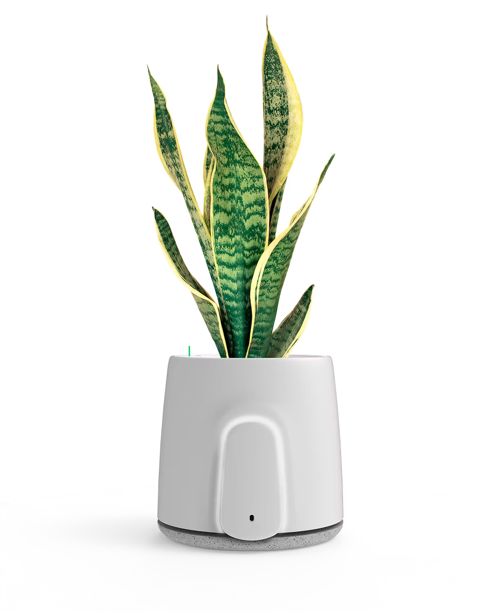
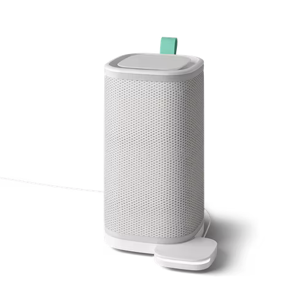

```{r setup, include=FALSE}
knitr::opts_chunk$set(echo = TRUE)
library(knitr)
library(png)
library(readr)
library(printr)
```

## Vitesy

Vitesy è una azienda italiana nata nel 2016 specializzata nella produzione di purificatori d'aria per ambienti indoor che pone come primo obbiettivo la sostenibilità per l'ambiente.

```{r out.width = "60%", echo=FALSE}
include_graphics("images/vitesy_logo.png")

```


## Prodotti
I dati sono stati rilevati da 2 tipi di prodotti:

>*  **NATEDE**:

Un purificatore d'aria sostenibile che sfrutta i processi di Fitodepurazione, la capacità naturale delle piante di assorbire gli inquinanti dell’aria e trasformarli in nutrimento per la pianta stessa, e di fotocatalisi, basato sull'utilizzo di un filtro in ceramica trattato con tecnologia WO3 e di luce LED per eliminare gli agenti tossici.

```{r out.width = "60%", echo=FALSE}


```


>* **ETERIA**:

Un purificatore d'aria che sfrutta a sua volta la fotocatalisi ed è composto da due parti: Il modulo purificatore e la base di monitoraggio dell'aria.

```{r out.width = "60%", echo=FALSE}


```

## Parametri Misurati
I parametri misurati da questi due dispositivi che andremo ad analizzare sono i seguenti:

>* Temperatura
>* Umidità
>* Cov(Composti Organici Volatili)
>* CO(Monossido di Carbonio)
>* pm25(Polveri Sottili)
>* CO2(Anidride Carbonica)

Il dataset è composto da un file contente i vari dispositivi e le loro informazioni (Luogo, tipo di dispositivo, pianta, ecc.) e da un file contenente tutte le misurazioni effettuate dai dispositivi tra il 30 Agosto ed il 15 Dicembre 2021.


## Domande
Le domande a cui daremo una risposta sono:

>* Come variano nel tempo i dati rilevati? Possiamo notare pattern nell'andamento dei dati? 
>* Come cambiano i vari valori da Stato a Stato? 
>* E` possibile rilevare tramite correlazione il miglioramento della qualità dell'aria quando le ventole ed i led dei dispositivi sono in funzione?
>* Per quanto riguarda i Natede, c'è qualche vantaggio nel scegliere una pianta rispetto ad un'altra? Le piante hanno caratteristiche diverse?

## 1. Andamento temporale dei dati

Ora andremo a visualizzare parametro per parametro come essi variano di settimana in settimana.

```{r, echo=FALSE,out.width="49%",out.height="20%", fig.cap="Temperatura", fig.show='hold', fig.align='center'}
include_graphics(c("gifs/Animation_Temperature.gif","Plots/Temperature_All_data_byweekday.jpg"))

```

```{r, echo=FALSE,out.width="49%",out.height="20%", fig.cap="Umidità", fig.show='hold', fig.align='center'}
include_graphics(c("gifs/Animation_Humidity.gif","Plots/HumidityPlot_All_data_byweekday.jpg"))

```

```{r, echo=FALSE,out.width="49%",out.height="20%", fig.cap="Composti Organici Volatili", fig.show='hold', fig.align='center'}
include_graphics(c("gifs/Animation_Voc.gif","Plots/VocPlot_All_data_byweekday.jpg"))

```

```{r, echo=FALSE,out.width="49%",out.height="20%", fig.cap="Particelle Sottili", fig.show='hold', fig.align='center'}
include_graphics(c("gifs/Animation_pm25.gif","Plots/pm25Plot_All_data_byweekday.jpg"))

```

```{r, echo=FALSE,out.width="49%",out.height="20%", fig.cap="Monossido di Carbonio", fig.show='hold', fig.align='center'}
include_graphics(c("gifs/Animation_Co.gif","Plots/CoPlot_All_data_byweekday.jpg"))

```

```{r, echo=FALSE,out.width="49%",out.height="20%", fig.cap="Anidride Carbonica", fig.show='hold', fig.align='center'}
include_graphics(c("gifs/Animation_Co2.gif","Plots/Co2Plot_All_data_byweekday.jpg"))

```

## 2. Distribuzione dei dispositivi tra i vari stati

Come possiamo vedere dalla figura la maggior parte dei prodotti si trovano in Europa, in Nord America ed in Australia

```{r, echo=FALSE,out.width="90%", fig.show='hold', fig.align='center'}
include_graphics(c("Plots/Devices_map_plot.png","Plots/Devices_eumap_plot.png"))

```

Infatti gli Stati con il maggior numero di dispositivi sono rispettivamente gli USA, l'Italia, l'Inghilterra, la Germania, il Canada, l'Olanda e l'Australia.
Per questo motivo andremo ad analizzare i loro dati.

```{r, echo=FALSE,out.width="80%", fig.cap=c("Temperatura","Umidità","Composti Organici Volatili","Polveri sottili","Monossido di Carbonio","Anidride Carbonica"), fig.align='center'}
include_graphics(c("Plots/Country_Temperature_Plot.jpg","Plots/Country_Humidity_Plot.jpg",
                   "Plots/Country_Voc_Plot.jpg","Plots/Country_pm25_Plot.jpg",
                   "Plots/Country_Co_Plot.jpg","Plots/Country_Co2_Plot.jpg"))

```

## 3. Correlazione tra parametri misurati e stato del dispositivo

Proviamo ad eseguire il calcolo della correlazione tra i vari parametri(non terremo conto del Monossido di Carbonio dato il basso numero di rilevazioni) e lo stato di funzione dei led/ventole tramite metodo di Pearson raggruppando le misurazioni per dispositivo ed orario di rilevazione concentrandoci sui dati misurati in Italia:
```{r, echo=FALSE}
Corr_Italy <- readRDS(file = "Italy_corr.rds")
head(Corr_Italy)
```


Come notiamo dagli alti valori ottenuti possiamo dedurre che la correlazione non è adatta per rilevare questo tipo di eventi per delle semplici motivazioni tra cui:

>* I dispositivi possono essere settati per mettersi in funzione alla rilevazione di una scarsa qualità dell'aria.
>* Questa misurazione non tiene conto da quanto sono in funzione i dispositivi
>* L'alta variabilità dei parametri non è adatta per una misura di correlazione 

## 4. Studio dei vari tipi di piante

I seguenti sono le 6 piante più usate nei Natede:
```{r, echo=FALSE}
Plant_Count <- readRDS(file = "Plant_Count.rds")
Plant_Count[1:6,]
```

<br>

```{r, echo=FALSE,out.width="80%", fig.cap=c("Umidità","Composti Organici Volatili","Polveri sottili","Monossido di Carbonio","Anidride Carbonica"), fig.align='center'}
include_graphics(c("Plots/Plant_Humidity_Plot.jpg","Plots/Plant_Voc_Plot.jpg","Plots/Plant_pm25_Plot.jpg",
                   "Plots/Plant_Co_Plot.jpg","Plots/Plant_Co2_Plot.jpg"))

```

Tra le varie piante non notiamo una vincitrice assoluta, ma possiamo vedere che ognuna di esse ha caratteristiche diverse con i propri pro e contro. In particolare il Clorofito porta risultati inferiori per quanto riguarda le polveri sottili ed i Composti Organici volatili, ma ha una grande performance nel ridurre Anidride Carbonica e Monossido di Carbonio durante le ore notturne rendendola così un ottima scelta per una camera da letto.

```{r, echo=FALSE,out.width="80%", fig.align='center'}
include_graphics(c("images/chlorophytum_NG1.jpg"))


```
Se invece dovessimo scegliere una pianta più "eclettica" allora l'Anturio farebbe al caso nostro dato che dà buoni risultati in ogni categoria.
```{r, echo=FALSE,out.width="80%", fig.align='center'}
include_graphics(c("images/anturio.jpg"))


```


